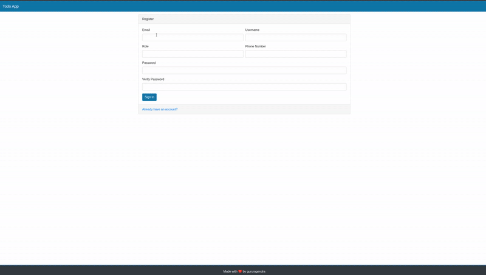

# 📝 FastAPI Todo Application

A modern, full-stack todo application built with FastAPI, SQLAlchemy, and Bootstrap. Features JWT authentication, responsive design, and clean architecture.

## 🌟 Features

### Core Functionality
- ✅ **Complete Todo Management** - Create, read, update, and delete todos
- 🔐 **User Authentication & Authorization** - Secure JWT-based authentication, password hashing
- 👤 **User Registration & Login** - Complete user management system
- 🎯 **Priority System** - Set todo priorities from 1-5
- ✔️ **Task Completion** - Mark todos as complete/incomplete
- 📱 **Responsive Design** - Mobile-friendly Bootstrap UI

### 🛠️ Technology Stack
- 🚀 **FastAPI** - web framework 
- 🗄️ **SQLAlchemy** - SQL toolkit and ORM
- � **SQLite** - database engine
- � **Pydantic** - Data validation using Python type hints for type-safe operations
- 🔒 **python-jose** - JWT token handling for secure authentication
- � **bcrypt** - Advanced password hashing for secure user authentication
- ⚡ **uvicorn** - Lightning-fast ASGI server for production deployment

## 📋 API Endpoints

### Authentication
- `GET /auth/login-page` - Login page
- `GET /auth/register-page` - Registration page
- `POST /auth/token` - Generate JWT token
- `POST /auth/register` - Create new user account

### Todos
- `GET /todos/todo-page` - Todo list page
- `GET /todos/add-todo-page` - Add todo page
- `GET /todos/edit-todo-page/{todo_id}` - Edit todo page
- `POST /todos/add-todo` - Create new todo
- `PUT /todos/edit-todo/{todo_id}` - Update existing todo
- `DELETE /todos/delete-todo/{todo_id}` - Delete todo

### Users
- `GET /user/` - Get user information
- `POST /user/` - Create new user
- `PUT /user/password` - Change user password

## Demo

<p align="center">
  
</p>

## 📁 Project Structure

```
todo_app/
├── main.py                 # Application entry point
├── database.py             # Database configuration
├── models.py               # SQLAlchemy models
├── schemas.py              # Pydantic schemas
├── settings.py             # Application settings
├── utils.py                # Utility functions
├── routers/                # API route modules
│   ├── __init__.py
│   ├── auth.py             # Authentication routes
│   ├── todos.py            # Todo CRUD operations
│   ├── user.py             # User management
│   └── admin.py            # Admin functionality
├── templates/              # Jinja2 HTML templates
│   ├── layout.html         # Base template
│   ├── navbar.html         # Navigation component
│   ├── login.html          # Login page
│   ├── register.html       # Registration page
│   ├── todo.html           # Todo list view
│   ├── add-todo.html       # Add todo form
│   └── edit-todo.html      # Edit todo form
├── static/                 # Static assets
│   ├── css/
│   │   ├── base.css        # Custom styles
│   │   └── bootstrap.css   # Bootstrap framework
│   └── js/
│       ├── base.js         # Custom JavaScript
│       ├── bootstrap.js    # Bootstrap components
│       ├── jquery-slim.js  # jQuery library
│       └── popper.js       # Popper.js for tooltips
└── myenv/                  # Virtual environment
```

## 🚀 Getting Started

### Prerequisites
- Python 3.8+
- pip (Python package manager)

### Installation

1. **Clone the repository**
   ```bash
   git clone <repository-url>
   cd todo_app
   ```

2. **Create and activate virtual environment**
   ```bash
   python -m venv myenv
   source myenv/bin/activate  # On Windows: myenv\Scripts\activate
   ```

3. **Install dependencies**
   ```bash
   pip install -r requirements.txt
   ```

4. **Run the application**
   ```bash
   uvicorn main:app --reload
   ```

5. **Access the application**
   - Open your browser and navigate to `http://localhost:8000`
   - You'll be redirected to the login page
   - Register a new account or use existing credentials


